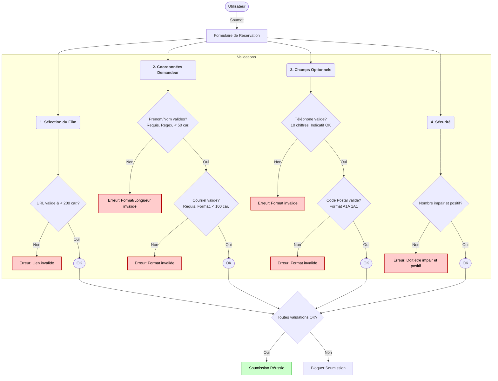

# Formulaire de Réservation de Film - TELUQ

Application Blazor WebAssembly pour la gestion des demandes de réservation de films.

## 🔗 Démo en ligne

**Lien de démonstration:** [https://teluqmovieform.netlify.app](https://teluqmovieform.netlify.app/)

## 🚀 Comment exécuter le projet

### Prérequis
- [.NET 10 SDK](https://dotnet.microsoft.com/download/dotnet/10.0) ou version ultérieure

### Étapes d'exécution

1. **Cloner le dépôt**
   ```bash
   git clone https://github.com/simondadiamond/TeluqMovieForm.git
   cd TeluqMovieForm
   ```

2. **Restaurer les dépendances**
   ```bash
   dotnet restore
   ```

3. **Exécuter l'application**
   ```bash
   dotnet run
   ```

4. **Accéder à l'application**
   
   Ouvrir votre navigateur et accéder à : `https://localhost:5275` (ou le port indiqué dans la console)

### Build pour production
```bash
dotnet publish -c Release
```

---

## 📋 Schéma d'organisation du formulaire et validations


---

## 🔧 Attributs de validation personnalisés

### 1. **OddNumberAttribute**
Vérifie que le nombre saisi est impair.
- Permet `null` si utilisé avec `[Required]` séparément
- Valide que : `n % 2 ≠ 0`
- Valide implicitement que le nombre est positif (n > 0) pour éviter les erreurs logiques
- Message d'erreur : "Le nombre doit être impair et positif."
- **Note technique :** Retourne `validationContext.MemberName` pour assurer l'association correcte avec le champ dans l'UI Blazor

### 2. **CanadianPhoneAttribute**
Valide un numéro de téléphone au format canadien/nord-américain.
- Accepte les chiffres, espaces, tirets et parenthèses
- Extrait exactement 10 chiffres du format saisi
- Vérifie que l'indicatif régional (1er chiffre) ≠ 0 ou 1
- Vérifie que le numéro local (4e chiffre) ≠ 0 ou 1
- Permet `null` ou vide (champ optionnel)
- **Note technique :** Retourne `validationContext.MemberName` pour assurer l'association correcte avec le champ dans l'UI Blazor

### 3. **CanadianPostalCodeAttribute**
Valide un code postal au format canadien.
- Format accepté : `A1A 1A1` ou `A1A1A1` (avec ou sans espace)
- Expression régulière : `^[A-Za-z]\d[A-Za-z][ ]?\d[A-Za-z]\d$`
- Permet `null` ou vide (champ optionnel)
- **Note technique :** Retourne `validationContext.MemberName` pour assurer l'association correcte avec le champ dans l'UI Blazor

---

## ⚙️ Logique de soumission

### Fonctionnement
1. **Validation en temps réel :** Les champs sont validés à la sortie (focusout) et lors de la soumission
2. **OnValidSubmit :** La soumission n'est déclenchée que si toutes les validations passent avec succès
3. **Message de confirmation :** Affichage d'un message de succès avec les détails de la réservation directement dans la page
4. **Réinitialisation :** Bouton "Effectuer une autre demande" pour retourner au formulaire vierge

### Note technique importante
Les attributs de validation personnalisés retournent explicitement `validationContext.MemberName` dans leur `ValidationResult`. Cette approche résout un problème connu de Blazor où les messages de validation des attributs personnalisés ne s'affichent pas correctement dans les composants `ValidationMessage`. 

Cette solution est basée sur la recommandation officielle de l'équipe ASP.NET Core (voir [issue #38258](https://github.com/dotnet/aspnetcore/issues/38258)) qui indique que les `ValidationResult` doivent explicitement spécifier le nom du membre pour que le `DataAnnotationsValidator` puisse associer correctement les erreurs aux champs pendant la validation de soumission.

---

## 🛠️ Technologies utilisées

- **.NET 10** - Framework principal
- **Blazor WebAssembly** - Framework frontend
- **Bootstrap 5** - Framework CSS
- **Bootstrap Icons** - Bibliothèque d'icônes
- **DataAnnotations** - Système de validation

---

## 📁 Structure du projet

```
TeluqMovieForm/
├── Models/
│   └── MovieRegistrationModel.cs    # Modèle avec validations et attributs personnalisés
├── Services/
│   └── IMovieService.cs             # Interface du service de films
├── Pages/
│   └── MovieForm.razor              # Composant principal du formulaire
├── wwwroot/                         # Fichiers statiques
└── Program.cs                       # Point d'entrée de l'application
```

---

## 📝 Licence

Ce projet a été développé dans le cadre d'un test technique pour TELUQ.
